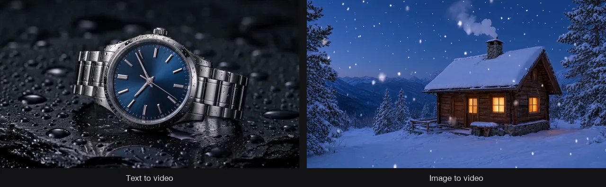
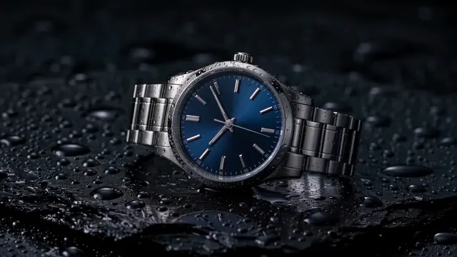
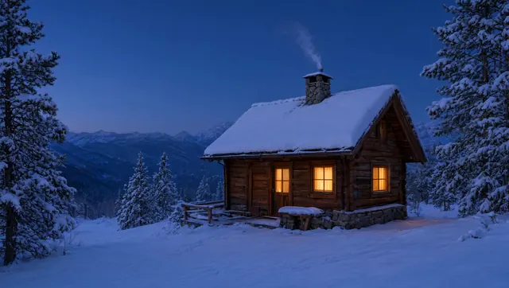

# AI Video Generator Skill

English | [简体中文](./README.zh-CN.md)

Generate, animate, edit, and extend short AI videos for ads, product stories, social posts, b-roll, transitions, and cinematic concepts, from inside Claude Code, Codex, or OpenClaw.

> [!IMPORTANT]
> Rendering needs a [Beatra](https://beatra.ai) account and uses credits. The skill itself is free to install.

| Question | Answer |
| --- | --- |
| **What it does** | Generate, animate, edit, and extend short AI videos for ads, product stories, social posts, b-roll, transitions, and cinematic concepts. |
| **Requirements** | Python 3.10+ and an agent that loads `SKILL.md` |
| **Cost** | Free to install. Each render uses credits on your Beatra account, and paid steps run only when you ask for that exact render or approve its card. |
| **Works with** | Claude Code, Codex, OpenClaw |

<p align="center"></p>

*One frame from each clip: a text-to-video product shot of a fictional wristwatch (left) and an image-to-video snowy cabin scene (right). AI-generated with Beatra.*

| Skill | Entry point | Version |
| --- | --- | --- |
| [`beatra-ai-video-studio`](skills/beatra-ai-video-studio) | [SKILL.md](skills/beatra-ai-video-studio/SKILL.md) | 1.3.0 |

This repository is published automatically from [beatra-ai/beatra-skills](https://github.com/beatra-ai/beatra-skills/tree/main/skills/beatra-ai-video-studio). Report issues there.

## Install

With the [`skills`](https://skills.sh) CLI:

```bash
npx skills add beatra-ai/ai-video-generator-skill
```

With the GitHub CLI:

```bash
gh skill install beatra-ai/ai-video-generator-skill beatra-ai-video-studio
```

Or clone this repository and copy `skills/beatra-ai-video-studio` into `~/.claude/skills/` for Claude Code,
`~/.agents/skills/` for Codex, or `~/.openclaw/skills/` for OpenClaw.

Or paste this into your agent:

```text
Install the beatra-ai-video-studio skill from https://github.com/beatra-ai/ai-video-generator-skill (folder skills/beatra-ai-video-studio), then follow its SKILL.md to connect my Beatra account.
```

## Examples

<p align="center"></p>

[▶ Watch the full video (MP4)](assets/full-1.mp4)

*Full 4-second 1080p text-to-video clip of a fictional wristwatch on wet black stone with soft rim light, with model-generated ambient sound. AI-generated with Beatra.*

Prompt:

```text
Cinematic luxury product ad shot. A steel automatic wristwatch with a deep midnight-blue sunburst dial, plain polished baton hour markers, no text and no logos on the dial, lies on a slab of wet black stone covered in small water droplets. Dark studio, soft rim light traces the case edge and bracelet, a gentle highlight glides across the sapphire crystal. The camera makes one slow, steady push-in from a three-quarter view toward the dial; a single water droplet slides slowly down the stone beside the watch. The watch stays perfectly still and keeps its exact shape, the second hand ticks smoothly. Shallow depth of field, crisp macro detail, restrained elegant pacing, ends on a close framing of the dial. Subtle ambient sound of soft water drips.
```

<p align="center"></p>

[▶ Watch the full video (MP4)](assets/full-2.mp4)

*Full 5-second 720p image-to-video clip of a snowy mountain cabin with falling snow and rising chimney smoke, with model-generated ambient sound. AI-generated with Beatra.*

Prompt:

```text
Gentle falling snow drifts down across the whole scene in soft, slow flakes. Chimney smoke rises and curls lazily to the left. The window light glows warmly with a faint flicker. The camera makes one slow, smooth push-in toward the cabin. The cabin, roof, pine trees and mountains stay still and keep their exact shape. Calm, quiet winter evening pacing. Soft ambient sound of wind and falling snow.
```

## What you get

- **Direction before creation** — Clarify the action, camera, pacing, duration, and destination before creating the clip.
- **Use the right starting point** — Begin with words, one opening image, exact boundary frames, creative references, or existing footage.
- **Revise with purpose** — Review the delivered motion and choose one focused edit, extension, or new render.

## Use cases

- **Product videos** — Turn product stories, packshots, and creative references into short demonstration or reveal clips.
- **AI ad video** — Create concise campaign shots around one message, action, and placement.
- **Social clips** — Design short vertical or feed-ready ideas with purposeful pacing and framing.
- **Transitions and reveals** — Define exact first and last images and direct the movement between them.
- **Video edits** — Change a focused visual detail or style in existing footage and review what stayed recognizable.
- **B-roll and continuations** — Create a new supporting shot or add footage directly before or after one existing clip.

## FAQ

### What can I make with Beatra AI Video Studio?

You can create short product, ad, social, b-roll, transition, reveal, and cinematic concept clips from text, images, references, or existing footage.

### Can I start from my own image?

Yes. Use one image as the opening frame, or provide exact first and last images for a directed transition.

### Can it edit or continue existing footage?

Yes. It can make a focused change to one clip or add new footage directly before or after it, then help you review the result.

### Which video model does it use?

It matches the requested inputs and settings to a currently eligible model. If you name a compatible model, that choice is kept.

### Can it make a longer sequence?

It can plan a longer idea shot by shot, create reviewable clips in sequence, and organize the delivered shots for captions, narration, transitions, and timeline assembly.

## Updates

Each installed skill checks for a new version at most once a day, verifies the
official archive before replacing itself, and leaves your installation untouched
if anything fails. Turn it off at any time — see
`references/automatic-updates-and-safety.md` inside the skill.

## License

[MIT-0](LICENSE) — free to use, modify, and redistribute, including
commercially. No attribution required. Same terms as these skills carry on
ClawHub.
